  <picture>
    <source media="(prefers-color-scheme: dark) and (max-width: 720px)" srcset="assets/hero-dark-narrow.svg" />
    <source media="(max-width: 720px)" srcset="assets/hero-light-narrow.svg" />
    <source media="(prefers-color-scheme: dark)" srcset="assets/hero-dark.svg" />
    
  </picture>

<h1 align="center">Binayak Jha</h1>

  <strong>Co-Founder at Imagine</strong> 
  Building a creative interface for intelligence.

  <a href="https://imaginei.ai">Imagine</a> ·
  <a href="https://binayakjha.com.np">Website</a> ·
  <a href="https://www.linkedin.com/in/binayak-jha/">LinkedIn</a> ·
  <a href="https://github.com/BinayakJha">GitHub</a>

I'm a computer science student at **Franklin & Marshall College** and a technical founder working where **AI, product, and human creativity** meet.

Right now, I'm building **[Imagine](https://imaginei.ai)**—a new way to think with AI, where ideas become interactive, evolving systems instead of disappearing into chat transcripts.

## Enter the world

Selected work. Open a chapter.

  
 <strong>Imagine</strong> — a creative interface for AI

  
Co-founding and leading the technical development of a creative interface for AI.

  
<a href="https://imaginei.ai">imaginei.ai</a>

  
 <strong>Bhanu</strong> — Nepali folk stories

  
An NLP system built with a student team to archive and translate regional Nepali folk stories.

  
 <strong>HamroGPT</strong> — an AI toolkit for Nepali users

  
An AI toolkit designed around the language and needs of Nepali users.

  
 <strong>USD/NPR forecasting</strong> — LSTM, GRU, and ARIMA

  
LSTM, GRU, and ARIMA models that reached 98% directional accuracy on held-out data.

  
 <strong>COVID Resources Nepal</strong> — a real-time resource platform

  
Helped build a real-time resource platform that reached 84,000+ people, supported 900+ families, and helped raise $20K during Nepal's oxygen crisis.

## A few things I've done

- Shipped **five full-stack AI products in five weeks**, each reaching 200+ active users.
- Founded a tech community that engaged **275+ students across 13 schools**.
- Selected as **1 of 34 students nationwide** for the Warburg Pincus Fellowship at Wharton.
- Co-authored peer-reviewed research on quantum cryptography applications.

## Tools I reach for

`Python` · `TypeScript` · `React` · `Next.js` · `FastAPI` · `Django` · `PyTorch` · `AWS` · `Docker` · `CI/CD`

## A year, walked

Public GitHub contributions over the last year, drawn as a ridge.

  <picture>
    <source media="(prefers-color-scheme: dark)" srcset="assets/contribution-world-dark.svg" />
    
  </picture>

---

  I'm always interested in ambitious products, exceptional builders, and serious conversations about the future of AI.

  <a href="https://imaginei.ai">imaginei.ai</a> ·
  <a href="https://binayakjha.com.np">binayakjha.com.np</a> ·
  <a href="https://www.linkedin.com/in/binayak-jha/">LinkedIn</a>

